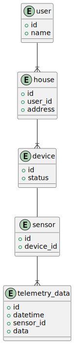

Все представленные в документации диаграммы созданы с помощью plantuml. Исходные файлы находятся в директории mkdocs/docs/puml_diagrams/. Сгенерированные файлы в директории mkdocs/docs/generated_diagrams.

# 1.1 Анализ и проектирование
## 1.1.1 Функциональность Smart Home Monolith:

### Управление отоплением:

- Пользователи могут удалённо включать/выключать отопление в своих домах. Методы turn-on, turn-of.
- Пользователи могут устанавливать желаемую температуру. Метод set-temperature
- Система поддерживает заданную температуру.

### Мониторинг температуры:

- Система получает данные о температуре с датчиков, установленных в домах.
- Пользователи могут просматривать текущую температуру в своих домах через веб-интерфейс.

## 1.1.2 Архитектура монолитного приложения
- Язык программирования: Java
- База данных: PostgreSQL
- Архитектура: Монолитная, все компоненты системы (обработка запросов, бизнес-логика, работа с данными) находятся в рамках одного приложения.
- Взаимодействие: Синхронное, запросы обрабатываются последовательно.
- Масштабируемость: Ограничена, так как монолит сложно масштабировать по частям.
- Развертывание: Требует остановки всего приложения.

## 1.1.3 Домены и границы контекстов в системе
### Домен: Управление устройствами
  * Поддомен: Управление отоплением
    - Контекст: Включение, выключение реле
    - Контекст: Установка целевой температуры
  * Поддомен: Автоматическое поддержание температуры
    - Контекст: Регулировка подачи тепла
### Домен: Мониторинг температуры
  * Поддомен: Получение температуры с датчиков
    - Контекст: Получение данных с датчиков температуры
  * Поддомен: Отображение данных пользователю
    - Контекст: Отображение текущей температуры в доме пользователя

## 1.1.4 Диаграмма C4 Context. Взаимодействие монолитного приложения с внешним миром
  

  Также развернута документация в папке mkdocs.

# 1.2 Архитектура микросервисов
## 1.2.1 Декомпозиция на микросервисы
  1. **Device Managment** - микросервис, отвечает за выполнения команд пользователем, регистрирует устройства пользователя. Контролирует температуру.
  2. **Telemetry** - микросервис, регистрирует датчики. Получает и обрабатывает данные с датчиков. Возвращает пользователю информацию о температуре.

## 1.2.2 Определение взаимодействия
  1. Все запросы от пользователя поступают через API Gateway.
  2. API Gateway маршрутизирует запросы к микросервисам согласно настройкам
  3. Датчики регистрируются, подключаются к микросервису телеметрии, данные с датчиков сохраняются в таблицу и публикуются в Kafka
  4. Сервис управления устройствами выполняет команды пользователя, сохраняет настройки (целевая температура), регистрирует устройства, управляет устройствами и поддерживает температуру основываясь на данных поступающих с Kafka.

## 1.2.3 Визуализация архитектуры
  **Диаграмма контейнеров**
  
  **Диаграмма компонентов**
  

  •	Созданы C4 диаграммы на уровне контейнеров (Containers) и компонентов (Components), визуализирующие архитектуру системы.

# 1.3 ER-диаграмма
## 1.3.1 Идентификация сущностей
 - Клиент (user)
 - Дом (house)
 - Устройство (device)
 - Тип устройства (device_type)
 - Датчик (sensor)
 - Данные телеметрии (telemetry_data)

## 1.3.2 Определение атрибутов
  **Сущность 'Клиент (user)'**

  * `id` - уникальный идентификатор клиента
  * `name` - имя клиента

  **Сущность 'Дом (house)'**
  * `id` - уникальный идентификатор дома
  * `user_id` - идентификатор клиента, внешний ключ к таблице `users`
  * `address` - адрес

  **Сущность 'Устройство (device)'**
  * `serial_number` - уникальный идентификатор устройства
  * `status` - текущее состояние устройства (включено/выключено)

  **Сущность 'Датчик (sensor)'**
  * `serial_number` - уникальный идентификатор датчика
  * `device_id` - уникальный устройства к которому подключен датчик

  **Сущность 'Данные телеметрии (telemetry_data)'**
  * `serial_number` - уникальный идентификатор датчика
  * `datetime` - дата и время
  * `value` - данные телеметрии

## 1.3.3 Описание связей
  * **Клиент — Дом:** один-ко-многим, у одного клиента может быть несколько домов. Каждый дом связан только с одним клиентом.
  * **Дом - Устройство:** один-ко-многим, в одном доме может быть несколько устройств. Устройство может быть подключено только к одному дому.
  * **Устройство - Датчик:** один-к-одному, один датчик одно устройство.
  * **Датчик - Данные телеметрии:** один-ко-многим (current).
## 1.3.4 Построение ER-диаграммы
  

# 1.4 Создание и документирование API
## 1.4.1 Выбор типов API
  В системе SmartHome будем использовать синхронный REST API для взаимодействия с пользователем, устройствами и датчиками
## 1.4.2 Проектирование API для сервиса device-managment
  **Регистрация устройства**
  * Эндпоинт: /device-managment/add_device
  * Метод: POST
  * Описание: Регистрирует устройство

  **Получение информации о состоянии устройства**
  * Эндпоинт: /device-managment/status_device
  * Метод: GET
  * Описание: Возвращает информацию о состоянии устройства включено/выключено

  **Изменение состояния устройства**
  * Эндпоинт: /device-managment/change_device_status
  * Метод: PUT
  * Описание: Метод для включения выключения устройства

  **Регистрация датчика**
  * Эндпоинт: /device-managment/add_sensor
  * Метод: POST
  * Описание: Регистрация датчика. При регистрации датчик сразу привязывается к устройству

  **Установка целевой температуры**
  * Эндпоинт: /device-managment/set_target_temperature
  * Метод: POST
  * Описание: Установка целевой температуры. Значение необходимо для автоматического поддержания температуры

  **Получение целевой температуры**
  * Эндпоинт: /device-managment/set_target_temperature
  * Метод: GET
  * Описание: Получение целевой температуры. Метод для отображение информации клиенту

## 1.4.3 Проектирование API для сервиса telemetry
  **Установка текущей температуры**
  * Эндпоинт: /telemetry/set_current_temperature
  * Метод: POST
  * Описание: Установка текущей температуры. Используется датчиками

  **Установка текущей температуры**
  * Эндпоинт: /telemetry/get_current_temperature
  * Метод: GET
  * Описание: Получение последнего значения температуры по серийному номеру датчика

## 1.4.4 Описание контрактов взаимодействия
  **Регистрация устройства**
  * Формат запроса:
  {
    "serial_number": "string",
    "status": false
  }
  * Формат ответа
  boolean
  * Коды ответа
  200 - успех, 400 - не удалось добавить (устройство уже добавлено) 500 - ошибка сервера

  **Получение информации о состоянии устройства**
  * Формат запроса:
  "serial_number": "string"
  * Формат ответа
  boolean
  * Коды ответа
  200 - успех, 500 - ошибка сервера

  **Изменение состояния устройства**
  * Формат запроса:
  {
    "serial_number": "string",
    "status": false
  }
  * Формат ответа
  boolean
  * Коды ответа
  200 - успех, 500 - ошибка сервера

  **Регистрация датчика**
  * Формат запроса:
  {
    "serial_number": "string",
    "device_id": "string"
  }
  * Формат ответа
  boolean
  * Коды ответа
  200 - успех, 400 - не удалось зарегистрировать, 500 - ошибка сервера

  **Установка целевой температуры**
  * Формат запроса:
  {
    "device_id": "string",
    "temperature": float
  }
  * Формат ответа
  boolean
  * Коды ответа
  200 - успех, 500 - ошибка сервера

  **Получение целевой температуры**
  * Формат запроса:
  device_id: "string"
  * Формат ответа
  float
  * Коды ответа
  200 - успех, 500 - ошибка сервера

  **Установка текущей температуры**
  * Формат запроса:
  {
    "serial_number": "string",
    "value": 20
  }
  * Формат ответа
  boolean
  * Коды ответа
  200 - успех, 500 - ошибка сервера

  **Получение текущей температуры**
  serial_number: "string"
  * Формат ответа
  {
    "serial_number": "string",
    "value": float,
    "time": datetime
  }
  * Коды ответа
  200 - успех, 500 - ошибка сервера

## 1.4.5 Документирование API
[Device Managment](./mkdoc/docs-api/device-managment.yaml)
[Telemetry](./mkdoc/docs-api/telemetry.yaml)

# 2 Разработка MVP
# 2.1 Новые микросервисы и интеграция с монолитом
Микросервисы написаны на python FastAPI. Покрывают текущий функционал монолита.

**Управление устройствами**
* Микросервис работает совместно с СУБД postgres
* Сущности описанные в ER диаграмме определены в папке device-managment/entities
* Развертывание выполнено через docker-compose
* Микросервис добавлен в текущий репозиторий, папка device-managment

**Управление телеметрией**
* Микросервис работает совместно с InfluxDB
* Сущности описанные в ER диаграмме определены в папке telemetry/entities
* Развертывание выполнено через docker-compose
* Микросервис добавлен в текущий репозиторий, папка telemetry

# 2.2 Подготовка 3rd party сервисов для связи микросервисов
* Kafka развернута с помощью docker-compose и настроена
* В качестве API Gateway используется Kong. Конфигурация в папке compose/kong
* При поступлении данных с датчиков (микросервис telemetry) они записываются в InfluxDB и публикуются в Kafka (топик temperature_sensors). Микросервис device-managment подписывается на этот топик, отправляет подтверждение получения данных. Также в микросервисе device-managment отправляются логи в stdout о получении данных с брокера. Дальше может быть реализована логика отправка команды устройству если достигнута целевая температура.
* Тесты пройдены. В папке test написаны тесты на python. Добавлено окружение poetry. В файле test.py устанавливаются переменные host и gateway_port

